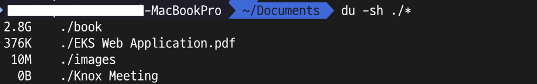
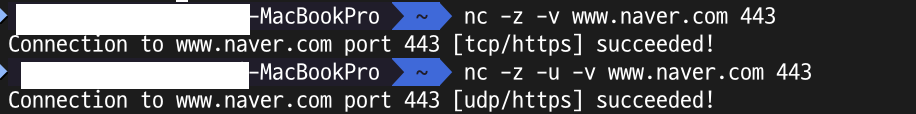

# 09 | 최소한 알고 있어야 할 서버 지식
## `sudo` 명령어
- root 권한이 필요할 때마다 담당자에게 요청하는 것은 업무 효율이 떨어짐. ➡️ 이 때 사용할 수 있는 명령어가 `sudo`임.
- 이 명령어를 통해 일반 사용자가 root 계정으로 `systemctl` 같은 명령어를 사용할 수 있음.
- `sudo` 명령어로 실행할 수 있는 명령어는 /etc/sudoers 파일이나 /etc/sudoers.d 디렉토리에 위치한 파일로 관리함.
- /etc/sudoers 파일을 수정할 때는 `visudo` 명령어를 사용함.
- /etc/sudoers 파일을 살펴보면 아래와 같은 설정을 볼 수 있음.

    
    
    ``` text
    root ALL = (ALL) ALL
    
    root: 규칙이 적용될 사용자 계정.
    첫번째 ALL: 이 규칙이 모든 호스트에서 적용됨(실질적으로는 로그인한 서버).
    (ALL): root가 모든 사용자의 권한으로 명령을 실행할 수 있음. (oracle)이라면 oracle 사용자의 권한으로만 명령을 실행할 수 있음.
    마지막 ALL: 모든 명령어(any command)를 실행할 수 있음.
    ```

## `ps` 명령어
- `ps` 명령어로는 프로세스 상태를 확인할 수 있음.
- 아래는 프로세스가 점유하는 메모리 사용량이 높은 프로세스 상위 5개를 확인하는 명령어임.
    ```shell
    ## Linux
    ps aux --sort -rss | head -n 5
    ```
    - a: 현재 터미널에 연결된 모든 사용자의 프로세스를 보여주라
    - u: 사용자 친화적인 형식으로 정보를 출력해라
    - x: 터미널에 연결되지 않은 백그라운드 프로세스나 시스템 데몬까지 모두 보여주라
    - sort -rss: rss기준으로 (-)내림차순으로 정렬해라
    ```shell
    ## MacOS
    ps -ax -o pid,user,%mem,rss,comm | sort -k4 -nr | head -n 5
    ```
    - ax: 시스템에서 실행 중인 모든 프로세스를 보여주라
    - o: 뒤의 컬럼을 출력해라
    - pid,user,%mem,rss,comm: 프로세스 ID, 사용자, 메모리 점유율, 실제 사용 중인 물리 메모리, 실행 파일 이름
    - k4: 4번째 컬럼인 rss을 기준으로 정렬해라
    - n: 숫자로 인식해서 정렬해라
    - r: 내림차순으로
>`ps`는 특정 시점의 프로세스 상태를 스냅샷으로 보여주기 때문에 실시간으로 모니터링하고 싶을 때는 `top`이나 `htop` 명령어를 사용하는 것이 유용함.

## `kill` 명령어
- 프로세스를 종료할 때 사용하는 명령어임. 명령행 인자로 프로세스 ID를 사용함.
- 옵션으로는 `-15(기본값)`, `-9`가 있음.
    - `-15`: SIGTERM(Signal Terminate) 신호를 보내서 프로세스가 안전하게 종료될 수 있게 함.
    - `-9`: SIGKILL 신호를 보내서 운영체제가 강제적으로 프로세스를 종료시켜버림.

## `&` 제어 연산자와 `nohup` 명령어
- 서버 프로그램을 백그라운드 프로세스로 실행하려면 `&` 제어 연산자를 명령어 뒤에 붙임.
- 사용자가 로그아웃하면 백그라운드 프로세스가 함께 종료될 수 있음.
- 터미널을 종료해도 백그라운드 프로세스가 계속 실행되게 하라면 `nohup` 명령어와 `&`를 함께 사용하면 됨.
- `nohup` 명령어는 No Hang Up을 뜻하는 명령어로, 터미널 연결이 끊길 때 전송되는 HUP 시그널이 프로세스에 전달되지 않게 함.
> `2>&1` : 2는 표준 오류, &1은 표준 출력임. ➡️ 표준 오류를 표준 출력과 동일한 경로로 전달하라는 의미임.

## `du` 명령어
- `du` 명령어는 disk usage의 약자로, 하위 디렉토리나 파일이 차지하는 용량을 쉽게 확인할 수 있음.
- `-sh` 옵션과 함께 쓸 수 있는데 s는 하위 디렉토리의 용량 합과 파일의 크기를 보여주고, h는 바이트 대신 사람이 읽기 쉬운 용량으로 표시하는 옵션임.
  

## `ulimit` 명령어
- 프로세스는 데이터 입출력이 필요할 때 OS로부터 파일 디스크립터를 할당받음.
- 파일 디스크립터 개수는 `ulimit -n` 명령어로 확인할 수 있고, `ulimit -n 개수` 명령어로 변경할 수 있음.
- `ulimit -n` 명령어를 실행했을 때 iterm 터미널에서는 256, 인텔리제이 터미널에서는 10240 이라는 결과를 확인함.
- 결과가 다른 이유는 프로그램(자식 프로세스)이 실행될 때, 그 프로그램을 실행시킨 부모 프로세스의 한도를 그대로 물려받기 때문임.

## `crontab` 명령어
- `crontab -e` 명령어를 입력하면 크론탭 편집창이 열리게 되는데 이때 문법은 (시간 패턴 + 실행할 명령어)로 구성됨.
- 시간 패턴은 `* * * * *`로 작성하고, 분 시 일 월 요일 순임.

## `alias` 명령어
- `alias` 명령어로 별칭을 등록할 수 있고, `alias`만 입력하면 현재 정의된 모든 별칭을 볼 수 있음.
- 별칭은 **현재 터미널 세션에서만 적용**되기 때문에 로그아웃 후에도 계속 사용하려면 쉘 구성 파일에 alias 설정을 추가해야 함.
```shell
alias cdweb='cd /var/www/html'
```

## `ifconfig` 명령어
- 서버의 IP 주소를 알기위해 사용하는 명령어임. 요즘은 `ip` 명령어로 대체되었다고 함.(ex `ip a`)
- 해당 명령어를 실행했을  외부 IP가 아닌 내부 IP만 알려줌.
- 외부 IP를 알기 위해서 `curl ifconfig.me`를 사용함.

## `nc` 명령어
- 해당 서버의 특정 포트와 연결이 잘 되는지 확인하는 명령어임.
  ```shell
  nc -z -v www.naver.com 443
  ```
    - z: 데이터 전송 없이 특정 포트가 열려 있는지만 확인하는 옵션
    - v: 추가 정보를 출력하는 옵션(사용하는 것을 권장)
    - u: UDP 포트가 열려 있는지 여부를 확인하는 옵션

  

## `netstat` 명령어
- `netstat` 명령어를 사용하면 현재 서버에서 열려 있는 서버 포트를 확인할 수 있음.
- 리눅스에서의 옵션(MacOS와는 옵션이 다름)
  - l: 리스닝 서버 소켓을 출력함.
  - p: 소켓을 사용하는 PID/프로그램 이름을 출력함.
  - u: UDP 소켓을 출력함.
  - t: TCP 소켓을 출력함.
  - n: 포트나 주소를 숫자로 출력함.
  - a: 사용 중인 전체 포트를 출력함.
```shell
## Linux
netstat -anp
## MacOS
lsof -i
## MacOS(특정 포트만 확인하고 싶다면)
lsof -1 :8080
```