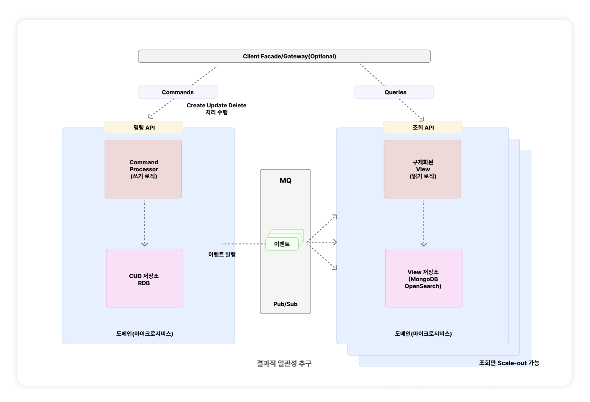

# 11 | 자주 쓰는 서버 구조와 설계 패턴

## CQRS 패턴

### 개념 및 배경
- **CQRS(Command Query Responsibility Segregation)** 는 명령(Command)과 조회(Query)의 책임을 분리하는 패턴임.
- 일반적으로 시스템의 상태를 변경하는 명령(Create, Update, Delete)보다 상태를 가져오는 조회(Read) 요청의 빈도가 훨씬 높음.
- 기존의 단일 저장소/단일 모델 방식은 읽기와 쓰기 작업으로 인한 리소스 교착 상태가 발생하거나, 복잡한 도메인에서 유지보수가 어려워지는 문제가 있음.
- 따라서 비즈니스 로직이 복잡한 **명령 모델**과 성능이 중요한 **조회 모델**을 분리하여 각 기능에 최적화된 구현을 지향함.

### 구조와 특징
- **명령(Command) 측면**
    - 데이터의 무결성과 정합성이 중요하므로 쓰기에 최적화된 **관계형 데이터베이스(RDBMS)** 를 주로 사용함.
    - 비즈니스 규칙을 표현하기 적합한 언어(예: Java)를 사용하여 복잡한 로직을 처리함.
- **조회(Query) 측면**
    - 단순 조회 기능 위주이며 빠른 응답 속도가 중요함.
    - 조회 성능이 뛰어난 **NoSQL(MongoDB, Elasticsearch)** 을 사용하거나 캐시를 적극적으로 적용함.
    - 트래픽이 몰릴 경우 조회 서비스 인스턴스만 독립적으로 스케일 아웃(Scale Out)하여 확장하기 유리함.

### 데이터 동기화 (Eventual Consistency)
- 명령 DB와 조회 DB가 물리적으로 분리될 경우, 두 저장소 간의 데이터 불일치가 발생함.
- 이를 해결하기 위해 **이벤트 메시지 주도 아키텍처**를 사용함.
    1. 명령 서비스가 데이터를 쓰고 이벤트를 메시지 브로커(Kafka, RabbitMQ 등)에 발행함.
    2. 조회 서비스는 이벤트를 구독하고 있다가, 메시지를 수신하여 조회용 DB를 최신 상태로 동기화함.
- 이 과정에서 데이터가 즉시 일치하지 않을 수 있지만, 시간이 지나면 결과적으로 일치하게 되는 **결과적 일관성(Eventual Consistency)** 을 추구함.

### 마이크로서비스와 API Composition 문제 해결
- 마이크로서비스 환경에서 여러 서비스의 데이터를 모아서 보여줘야 할 때, **API Composition**(상위 서비스가 여러 하위 서비스를 호출하여 조합) 방식은 서비스 간의 강한 의존성을 만듦.
- 하위 서비스의 API가 변경되면 상위 서비스도 변경해야 하는 문제가 있음.
- CQRS를 적용하여 별도의 **조회 전용 서비스(View Service)** 를 구축하고, 각 원천 서비스로부터 이벤트를 받아 데이터를 미리 적재해두면 직접적인 의존성을 제거하고 조회 성능을 높일 수 있음.

### 장단점 정리
- **장점**
    - 명령과 조회 모델을 분리하여 각각의 목적에 맞게 최적화할 수 있음.
    - 조회 요청이 많은 서비스의 부하를 효과적으로 분산시킬 수 있음.
    - 도메인이 복잡할수록 비즈니스 로직과 조회 로직을 분리하여 코드 가독성과 유지보수성을 높일 수 있음.
- **단점**
    - 모델과 저장소가 분리되면서 관리해야 할 코드의 양과 복잡도가 증가함.
    - 데이터 동기화를 위한 메시징 시스템 등 추가적인 인프라 구축 및 운영 비용이 발생함.
    - 데이터가 즉시 일치하지 않는 결과적 일관성 문제를 비즈니스적으로 허용할 수 있는지 검토해야 함.

## 참고자료
- [SK C&C 기술 블로그, 마이크로서비스 관계 패턴 - 읽기와 쓰기 분리: CQRS패턴](https://engineering-skcc.github.io/microservice%20outer%20achitecture/inner-architecture-cqrs/)
- [우아콘 2021, B마트 전시 도메인 CQRS 적용하기](https://www.youtube.com/watch?v=fg5xbs59Lro&t=4s)