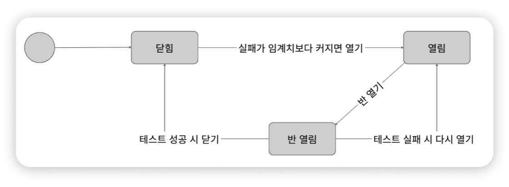

# 04 | 외부 연동이 문제일 때 살펴봐야 할 것들

## 스프링에서 외부 API를 호출하는 방법
- OpenFeign
- RestTemplate
- WebClient
- [spring 스터디 때 민주님이 작성한 자료](https://github.com/2025-cs-study/long-octopus-leg/blob/924e4459c61b5da9a09a54495c59900f81f5ddfd/spring/11_using_rest_endpoints/README.md)

## 외부 연동에 실패했을 때의 해결책1 : 재시도

### Resilience4J를 사용한 Retry 방법
#### 의존성 추가
```xml
<dependency>
    <groupId>io.github.resilience4j</groupId>
    <artifactId>resilience4j-retry</artifactId>
    <version>2.1.0</version>
</dependency>
<dependency>
    <groupId>io.github.resilience4j</groupId>
    <artifactId>resilience4j-spring-boot3</artifactId>
    <version>2.1.0</version>
</dependency>
```

#### application.yml 설정
```yaml
resilience4j:
  retry:
    instances:
      external-api:
        max-attempts: 3              # 최대 재시도 횟수
        wait-duration: 1s            # 재시도 간격
        retry-exceptions:            # 재시도할 예외
          - java.net.ConnectException
          - java.util.concurrent.TimeoutException
        ignore-exceptions:           # 재시도하지 않을 예외
          - java.lang.IllegalArgumentException
```

#### 사용 예시
```java
@Component
public class ExternalApiService {
    
    @Retryable(name = "external-api")
    public String callExternalApi() {
        // 외부 API 호출 로직
        return restTemplate.getForObject("https://api.example.com/data", String.class);
    }
    
    // 재시도 실패 시 fallback 메서드
    @Recover
    public String fallback(Exception ex) {
        return "기본값 또는 캐시된 데이터";
    }
}
```

#### Spring @Retryable vs Resilience4j Retry 비교
| 구분 | Spring @Retryable | Resilience4j Retry |
|------|------------------|-------------------|
| **구현 방식** | Spring AOP 기반 (내부 호출 시 동작 안함) | 함수형 + 어노테이션 (내부 호출도 동작) |
| **기능 범위** | 재시도만 제공 | 재시도 + 서킷브레이커 + 레이트리미터 통합 |
| **백오프 전략** | 기본적인 고정/지수 백오프 | 정교한 랜덤화/지수 백오프 |
| **모니터링** | 기본 메트릭스 | Actuator 연동 상세 메트릭스 |
| **설정** | 어노테이션 파라미터 | application.yml 외부 설정 |
| **사용 시기** | 간단한 재시도 기능 | 복합적인 장애 처리 패턴 |

### 재시도가 가능한 조건
- 단순 조회 기능
- 연결 타임 아웃
- 멱등성을 가진 변경 기능

#### 멱등성이란?
**정의:** 첫 번째 수행을 한 뒤 여러 차례 적용해도 결과를 변경시키지 않는 작업 또는 기능의 속성

**HTTP 메서드별 멱등성**
- **멱등함**: GET, PUT (리소스 조회/대체)
- **멱등하지 않음**: POST, PATCH (호출할 때마다 응답이 달라짐)

#### 멱등한 API의 특징
- 두 번 이상 요청해도 결과가 처음 요청과 동일
- 서버 상태(DB)에도 영향을 미치지 않음
- 네트워크 오류 시 안전하게 재시도 가능
- 중복 요청(따닥) 방지

#### 멱등한 API 구현 방법
**1. 멱등키(Idempotency Key) 사용**
- API 요청 헤더에 `Idempotency-Key` 포함 (IETF 표준), 토스에서도 헤더에 멱등키를 포함함
- 동일한 멱등키 → 중복 요청으로 판단 → 첫 요청과 동일한 응답 반환

**2. 서버 처리 과정**

1. 헤더에서 멱등키 확인
2. DB에서 멱등키 존재 여부 조회
3. **새로운 키**: 요청 처리 후 응답과 함께 DB에 저장
4. **기존 키**: 실제 처리 없이 저장된 응답 데이터 반환

**3. 성능 개선 효과**
- 멱등키 요청은 도메인 로직을 거치지 않아 API 성능 향상

### 재시도 횟수와 간격
- 1 ~ 2번 재시도
- 3초의 간격을 두던, 1초 후, 2초 후, 3초 후 이런식으로 해결


## 외부 연동에 실패했을 때의 해결책2 : 서킷 브레이커
### 서킷 브레이커
- 서킷 브레이커는 누전 차단기와 비슷하게 동작해서 과도한 오류가 발생하면 연동을 중지시키고 바로 에러를 응답함.
- 서킷 브레이커는 **닫힘, 열림, 반 열림**의 3가지 상태를 갖음.

#### 닫힘(Closed) 상태 - 정상
- 모든 요청을 연동 서비스에 전달함.
- 실패 횟수를 추적함.
- 실패 임계치를 초과하면 열림 상태로 전환함.
#### 열림(Open) 상태 - 차단
- 연동 요청을 수행하지 않고, 바로 에러 응답을 리턴함.
- 열림 상태는 지정된 시간만 유지하고 이 시간이 지나면 반 열림 상태로 전환함.
#### 반 열림(Half-Open) 상태 - 테스트
- 일부 요청에 한해 연동을 시도함.
- 일정 시간 동안 반 열림 상태로 테스트를 하면서 연동을 성공하면 닫힘 상태로, 실패하면 열림 상태로 전환함.
### Resilience4J를 사용한 서킷 브레이커 방법

#### 의존성 추가
```xml
<dependency>
    <groupId>io.github.resilience4j</groupId>
    <artifactId>resilience4j-circuitbreaker</artifactId>
    <version>2.1.0</version>
</dependency>
<dependency>
    <groupId>io.github.resilience4j</groupId>
    <artifactId>resilience4j-spring-boot3</artifactId>
    <version>2.1.0</version>
</dependency>
```

#### application.yml 설정
```yaml
resilience4j:
  circuitbreaker:
    instances:
      external-api:
        failure-rate-threshold: 50          # 실패율 임계치 (50%)
        slow-call-rate-threshold: 50        # 느린 호출 임계치 (50%)
        slow-call-duration-threshold: 2s    # 느린 호출 기준 시간
        permitted-number-of-calls-in-half-open-state: 3  # 반열림 상태에서 허용할 호출 수
        sliding-window-size: 10             # 슬라이딩 윈도우 크기
        minimum-number-of-calls: 5          # 최소 호출 수
        wait-duration-in-open-state: 30s    # 열림 상태 유지 시간
```

#### 사용 예시
```java
@Component
public class ExternalApiService {
    
    @CircuitBreaker(name = "external-api", fallbackMethod = "fallback")
    public String callExternalApi() {
        // 외부 API 호출 로직
        return restTemplate.getForObject("https://api.example.com/data", String.class);
    }
    
    // 서킷 브레이커 동작 시 fallback 메서드
    public String fallback(Exception ex) {
        return "서비스가 일시적으로 사용할 수 없습니다. 잠시 후 다시 시도해주세요.";
    }
}
```

#### 서킷 브레이커 상태 모니터링
```java
@RestController
public class CircuitBreakerController {
    
    @Autowired
    private CircuitBreakerRegistry circuitBreakerRegistry;
    
    @GetMapping("/circuit-breaker/status")
    public String getCircuitBreakerStatus() {
        CircuitBreaker circuitBreaker = circuitBreakerRegistry.circuitBreaker("external-api");
        return "Circuit Breaker State: " + circuitBreaker.getState();
    }
}
```

## 외부 연동에 실패했을 때의 해결책3 : 이중화
- 비용이 많이 들어서 꼭 필요한 서비스에만 적용
- 예를 들어 결제는 필요하지만 로그 이중화는 비용 낭비일 수 있음.


### 참고자료
- [멱등성이 뭔가요?](https://docs.tosspayments.com/blog/what-is-idempotency)
- [resilience4j 공식 문서](https://resilience4j.readme.io/)