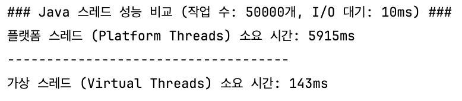

# 07 | IO 병목, 어떻게 해결하지

## IO 병목 현상의 문제점
- 데이터 입출력이 완료될 때까지 스레드는 아무 작업도 하지 않고 대기함
- 스레드가 블로킹되면 해당 스레드를 실행하는 CPU도 유휴 상태가 됨
- 스레드를 많이 생성하면 CPU 사용률을 높일 수 있지만, 메모리 병목이 발생할 수 있음
- 스레드가 증가하면 컨텍스트 스위칭 시간이 늘어나 CPU 효율성이 저하됨
- 입출력 작업은 일반적으로 코드 실행 시간보다 훨씬 오래 걸림

## 서버 성능 개선 방법
- 서버를 수평 확장 또는 수직 확장하여 자원을 추가로 확보함
- I/O 대기로 인한 CPU 낭비를 줄이고 요청 처리에 필요한 메모리를 절감함
- 경량 스레드(가상 스레드, 고루틴)를 사용함
- 논블로킹 또는 비동기 IO를 사용함

## 경량 스레드
- 자바의 가상 스레드와 Go 언어의 고루틴이 대표적인 경량 스레드임
- 경량 스레드는 언어 런타임이 관리하며, 런타임이 OS 스레드로 실행할 경량 스레드를 스케줄링함
- 플랫폼 스레드의 기본 스택 크기는 1MB이지만, 가상 스레드는 평균 2KB의 메모리를 사용함
- 만 개의 플랫폼 스레드는 약 10GB, 만 개의 가상 스레드는 약 28MB의 메모리를 사용함
- 가상 스레드가 블로킹되면 플랫폼 스레드와 언마운트되고, 해당 플랫폼 스레드는 대기 중인 다른 가상 스레드를 실행함
- 가상 스레드는 IO 중심 작업에서 효과적이며, 기존 코드를 크게 수정하지 않고 처리량을 높일 수 있음
- 블로킹 연산에는 IO 기능, Thread.sleep() 등이 포함됨

    <details>
        <summary>&nbsp;플랫폼 스레드 vs 가상 스레드 속도 비교 코드</summary>
    
    ```java
    import java.util.concurrent.*;
    
    public class ThreadPerformanceComparison {
    
        private static final int NUMBER_OF_TASKS = 50_000; // 실행할 작업 수
        private static final int PLATFORM_THREAD_POOL_SIZE = 100; // 플랫폼 스레드 풀 크기
        private static final int SLEEP_TIME_MS = 10; // I/O 대기 시간 시뮬레이션 (밀리초)
    
        public static void main(String[] args) throws InterruptedException {
            System.out.println("### Java 스레드 성능 비교 (작업 수: " + NUMBER_OF_TASKS + "개, I/O 대기: " + SLEEP_TIME_MS + "ms) ###");
    
            // 1. 플랫폼 스레드 풀 (Platform Threads)
            runPlatformThreads();
            System.out.println("------------------------------------");
    
            // 2. 가상 스레드 (Virtual Threads)
            runVirtualThreads();
        }
    
        /**
         * I/O 대기 시간을 시뮬레이션하는 작업
         */
        private static Runnable createIOTask(CountDownLatch latch) {
            return () -> {
                try {
                    // 실제 I/O 작업(네트워크 호출, DB 쿼리 등) 대신 Thread.sleep()으로 대기 시간 시뮬레이션
                    Thread.sleep(SLEEP_TIME_MS);
                } catch (InterruptedException e) {
                    Thread.currentThread().interrupt();
                } finally {
                    latch.countDown();
                }
            };
        }
    
        /**
         * 플랫폼 스레드 풀을 사용하여 작업 실행
         */
        private static void runPlatformThreads() throws InterruptedException {
            CountDownLatch latch = new CountDownLatch(NUMBER_OF_TASKS);
    
            long startTime = System.currentTimeMillis();
    
            // 고정된 크기의 플랫폼 스레드 풀 사용 (일반적인 웹 서버 모델)
            try (ExecutorService executor = Executors.newFixedThreadPool(PLATFORM_THREAD_POOL_SIZE)) {
                for (int i = 0; i < NUMBER_OF_TASKS; i++) {
                    executor.submit(createIOTask(latch));
                }
    
                // 모든 작업이 완료될 때까지 대기
                latch.await();
            }
    
            long endTime = System.currentTimeMillis();
            System.out.println("플랫폼 스레드 (Platform Threads) 소요 시간: " + (endTime - startTime) + "ms");
        }
    
        /**
         * 가상 스레드 풀을 사용하여 작업 실행
         */
        private static void runVirtualThreads() throws InterruptedException {
            CountDownLatch latch = new CountDownLatch(NUMBER_OF_TASKS);
    
            long startTime = System.currentTimeMillis();
    
            // 가상 스레드 사용 (JDK 21+ 필요)
            try (ExecutorService executor = Executors.newVirtualThreadPerTaskExecutor()) {
                for (int i = 0; i < NUMBER_OF_TASKS; i++) {
                    executor.submit(createIOTask(latch));
                }
    
                // 모든 작업이 완료될 때까지 대기
                latch.await();
            }
    
            long endTime = System.currentTimeMillis();
            System.out.println("가상 스레드 (Virtual Threads) 소요 시간: " + (endTime - startTime) + "ms");
        }
    }
    ```
  
    </details>

## 경량 스레드 사용 시 주의사항

### Pinning 문제
- 가상 스레드가 플랫폼 스레드에 고정되면 확장성이 저하됨
- Pinning은 가상 스레드가 실행 중인 플랫폼 스레드에 고정되어 분리되지 않는 상태를 의미함
- synchronized 블록이나 메서드 내에서 블로킹 작업을 수행할 때 발생함 ➡️ synchronized 블록을 ReentrantLock으로 대체하거나 tryLock()을 사용하여 해결할 수 있음
- 네이티브 메서드나 Foreign Function을 호출할 때 발생함
- 짧은 시간의 in-memory 연산은 문제가 없지만, 오래 걸리고 빈번한 블로킹 작업은 처리량에 악영향을 줌


### ThreadLocal 메모리 문제
- 가상 스레드는 이론상 무한히 생성할 수 있어 ThreadLocal을 과도하게 사용하면 메모리 부족이 발생할 수 있음
- ThreadLocal에 무거운 객체를 담지 말고 사용 후 반드시 remove()로 정리해야 함
- 플랫폼 스레드는 수백 개 정도의 ThreadLocal만 생성되지만, 가상 스레드는 수십만 개 이상 생성될 수 있음
- 가능하면 메서드 파라미터로 값을 전달하는 방식을 고려해야 함

### CPU 집약적 작업의 비효율
- 가상 스레드는 IO 대기 시간 동안 플랫폼 스레드를 다른 가상 스레드에 양보하여 효율을 높임
- CPU 집약적 작업이 많으면 플랫폼 스레드 수만큼만 동시 실행되어 이점이 제한적임

### 라이브러리 호환성
- 모든 기존 라이브러리가 가상 스레드 환경에서 최적으로 동작하지는 않음
- ThreadLocal을 많이 사용하거나 synchronized 블록이 많은 레거시 라이브러리는 성능 문제가 발생할 수 있음

### 디버깅과 모니터링
- 수십만 개의 가상 스레드가 동시에 실행되면 기존 디버깅 도구로 추적하기 어려움
- 스레드 덤프를 분석할 때 가상 스레드가 너무 많아 정보 파악이 복잡해질 수 있음

## 논블로킹 IO
- 논블로킹 IO는 입출력이 끝날 때까지 스레드가 대기하지 않음
- 루프 안에서 조회를 반복 호출하여 데이터를 읽었을 때만 처리하는 방식으로 구현됨
- 계속 확인하는 방식은 CPU 낭비가 심하므로, 실행 가능한 IO 연산 목록을 구해 해당 연산을 실행하는 방식을 사용함
- 블로킹 IO는 커넥션별로 스레드를 할당하지만, 논블로킹 IO는 클라이언트 수에 상관없이 소수의 스레드를 사용함
- 동시 접속 클라이언트가 증가해도 스레드 개수가 일정하게 유지되어 같은 메모리로 더 많은 연결을 처리할 수 있음
- 논블로킹 IO에서 동시성을 높이기 위해서는 그룹마다 스레드를 생성함

## 리액터 패턴
- 동시에 들어오는 여러 이벤트를 처리하기 위한 이벤트 처리 방법임
- 리액터와 핸들러로 구성됨
- 리액터는 이벤트가 발생할 때까지 대기하다가 이벤트가 발생하면 알맞은 핸들러에 전달함
- 핸들러는 이벤트를 받아 필요한 로직을 수행함

## 참고자료
- [KakaoPay 기술 블로그, [Project Loom] Virtual Thread에 봄(Spring)은 왔는가](https://tech.kakaopay.com/post/ro-spring-virtual-thread/)
- [삼성 인사이트리포트, 고성능 Java 애플리케이션 개발을 위한 필수 기술: Virtual Threads](https://s-core.co.kr/insight/view/%EA%B3%A0%EC%84%B1%EB%8A%A5-java-%EC%95%A0%ED%94%8C%EB%A6%AC%EC%BC%80%EC%9D%B4%EC%85%98-%EA%B0%9C%EB%B0%9C%EC%9D%84-%EC%9C%84%ED%95%9C-%ED%95%84%EC%88%98-%EA%B8%B0%EC%88%A0-virtual-threads/)