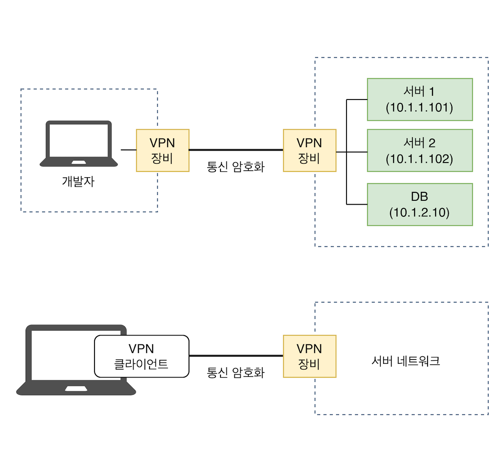

# 10 | 모르면 답답해지는 네트워크 기초

## www.google.com 을 입력한다면?

### 1. DNS 서버에 주소 물어보기
- 브라우저가 가장 먼저 "www.google.com 의 주소(IP)가 뭔가요?"라고 물어봄.
- **캐싱🙆**: 가장 먼저 내 컴퓨터(브라우저, OS)나 공유기에 저장된 기록(캐시)을 확인함. 여기에 주소가 있으면 바로 다음 단계로 넘어감.
- **캐싱🙅**: 캐시에 없다면 DNS 서버에 물어봄.

    
  
    - **루트 DNS 서버**: ".com을 담당하는 서버에게 물어봐."
    - **TLD(최상위 레벨 도메인) .com 서버**: "google.com을 담당하는 서버에게 물어봐."
    - **책임 DNS 서버**: "www.google.com 의 IP 주소는 `142.250.206.196`이야."

### 2. 최적의 경로 계획하기 (Routing과 ARP)
- 최종 목적지 IP 주소를 알았으니, 그곳까지 갈 최적의 경로를 찾음. 이 과정은 라우팅과 ARP의 협업으로 이루어짐.
- **라우팅 ➡️ 큰 그림**
  - 컴퓨터나 라우터는 가장 먼저 자신의 라우팅 테이블을 확인함.
  - 이 테이블은 BGP(인터넷 백본용), OSPF(기업 내부망용) 같은 라우팅 프로토콜이나 정적 설정으로 만들어짐.
  - 이를 통해 최종 목적지까지 가기 위한 다음 목적지(Next Hop)의 IP 주소를 결정함.

- **ARP ➡️ 한 걸음**
  - 다음 목적지 IP(ex. `192.168.0.1`)가 결정되면, 그 IP의 위치에 따라 ARP의 역할이 정해짐.
  - **만약 다음 목적지가 다른 네트워크에 있다면**:
    - ARP를 통해 **기본 게이트웨이(Default Gateway)** 의 MAC 주소를 찾아 패킷을 전달함.
  - **만약 다음 목적지가 같은 네트워크(로컬 서브넷) 안에 있다면**:
    - ARP를 통해 해당 IP의 실제 MAC 주소를 직접 찾아 패킷을 전달함.
  - **ARP 테이블에 필요한 MAC 주소가 없다면**:
    - 같은 네트워크 내의 모든 장비에게 브로드캐스트(`192.168.0.1` IP를 가진 분 찾아요!!)로 질문함.
    - 해당 IP를 가진 장비로부터 MAC 주소를 응답받아 ARP 테이블에 저장한 뒤 패킷을 전송함.

### 3. 도착과 응답
- 이 과정이 수많은 라우터를 거치며 반복되고, 마침내 패킷이 구글 서버에 도착함.
- 구글 서버는 요청에 대한 응답 데이터를 보내주고, 이 데이터가 다시 컴퓨터로 돌아와 브라우저에 구글 화면이 그려지게 됨.

## 라우팅 테이블과 ARP 테이블

### ARP 테이블이 필요한 이유(최적의 경로를 아는데 ARP 테이블이 왜 필요하지?)
- 라우팅 테이블은 논리적인 다음 목적지(IP 주소)를 결정하지만, 데이터를 물리적으로 전달하려면 바로 옆 장비의 실제 주소(MAC 주소)가 반드시 필요함.
- ARP 테이블로 **MAC 주소**를 알게 되어 패킷을 물리적으로 전달할 수 있게 함.

### 라우팅 vs ARP 테이블 비교

|   구분    |          라우팅 테이블           |               ARP 테이블                |
|:-------:|:--------------------------:|:------------------------------------:|
| **역할**  | 최종 목적지까지 가는 최적의 전체 경로를 알려줌 | 다음 한 걸음을 내딛기 위해 바로 옆 장비의 MAC 주소를 알려줌 |
| **범위**  |    인터넷 전체 (End-to-End)     |    같은 네트워크(로컬 서브넷) 내 (Hop-by-Hop)    |
| **내용**  |  목적지 네트워크 ↔️ 다음 라우터 IP 매핑  |          IP 주소 ↔️ MAC 주소 매핑          |
| **소유자** |            라우터             |      컴퓨터, 핸드폰, 라우터 등 모든 네트워크 기기      |
| **비유**  |     전국 고속도로 지도 (내비게이션)     |              옆집 이웃 연락처               |
> Hop-by-Hop은 네트워크에서 데이터 패킷이 최종 목적지까지 한 번에 가는 것이 아니라, 여러 개의 중간 장치(라우터)를 한 단계씩 거쳐서 전달되는 방식을 의미함.

## NAT (Network Address Translation)
- NAT는 네트워크 주소를 변환하는 기술로, 주로 인터넷에 연결된 라우터 같은 네트워크 장비가 담당함.
- 사설 IP와 공인 IP 간의 변환을 함.

### SNAT vs DNAT

|     구분      |                 SNAT (Source NAT)                 |           DNAT (Destination NAT)           |
|:-----------:|:-------------------------------------------------:|:------------------------------------------:|
| **바꾸는 주소**  |                 출발지(Source) IP 주소                 |           목적지(Destination) IP 주소           |
|   **방향**    |                내부 → 외부 (Outbound)                 |             외부 → 내부 (Inbound)              |
| **AWS 예시**  |                     NAT 게이트웨이                     |        NLB (Network Load Balancer)         |
|   **역할**    | Private Subnet의 서버가 인터넷에 접속할 때, 사설 IP를 공인 IP로 바꿔줌 | 외부 사용자가 공인 IP로 접속하면, 내부 서버의 사설 IP로 요청을 전달함 |

## 원격 접속: VPN vs Bastion Host

### 기본 개념
- 둘 다 "외부에서 내부망에 안전하게 접속한다"는 목표는 같지만, 방법이 다름.

|      구분      |      VPN (Virtual Private Network)       |           Bastion Host (점프 서버)           |
|:------------:|:----------------------------------------:|:----------------------------------------:|
|   **이미지**    |  |  |
|  **연결 방식**   |      내 컴퓨터와 회사 네트워크를 직접 연결 (암호화 터널)      |   나 → Bastion Host → DB 서버 순서로 두 번 접속    |
| **내 컴퓨터 상태** |       회사 내부 IP를 할당받아 논리적으로 내부인이 됨        |     여전히 외부인 상태로, Bastion Host를 원격 조종     |
|  **접근 단위**   |        네트워크 단위 (허용된 모든 내부 자원에 접근)        |   서버 단위 (Bastion Host를 통해 접속 가능한 서버만)    |

### VPN으로 사설 IP DB에 접근하는 원리
- VPN을 연결하면 다음과 같은 일이 일어남.
- **가상 네트워크 인터페이스 생성**: 내 컴퓨터에 tun0 또는 tap0 같은 가상 네트워크 카드가 생성됨.
- **회사 내부 IP 할당**: 이 가상 인터페이스에 회사 내부망의 사설 IP(ex. `10.0.1.50`)가 할당됨.
- **라우팅 테이블 수정**: 회사 내부 네트워크 대역(ex. `10.0.0.0/16`)으로 가는 모든 트래픽이 VPN 터널을 통하도록 라우팅 테이블이 자동으로 수정됨.
- **암호화 터널을 통한 전송**: 이제 `10.0.2.100` (회사 DB 서버)에 접속하면, 패킷이 암호화되어 인터넷을 통해 회사 VPN 게이트웨이로 전달됨.
- **복호화 및 내부 전달**: 회사의 VPN 게이트웨이가 패킷을 복호화하고, 내부망에서 마치 사내에서 보낸 것처럼 DB 서버로 전달함.
- 결과적으로, 물리적으로는 집에 있지만 논리적으로는 회사 내부망의 일부가 되어, 사설 IP를 가진 모든 내부 자원에 직접 접근할 수 있게 됨.

## 네트워크 장비: 라우터 & 스위치
- 라우터는 대표적인 3계층(네트워크) 장비임.
- 스위치는 대표적인 2계층(데이터 링크) 장비임.
- 스위치는 자신에게 연결된 장비들의 MAC 주소를 학습하여, 필요한 곳으로만 데이터를 정확히 전달하는 역할을 함.(반면에 1계층 장비인 허브는 모든 곳에 뿌림.)

## 참고자료
- <컴퓨터 네트워킹 하향식 접근> James F. Kurose 저
- [네트워크 정리](https://github.com/2025-cs-study/long-octopus-leg/tree/main/network)